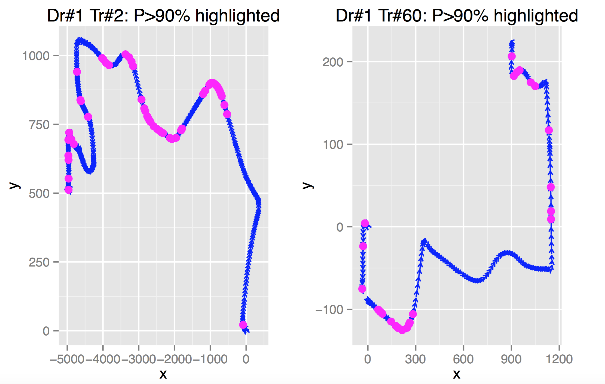
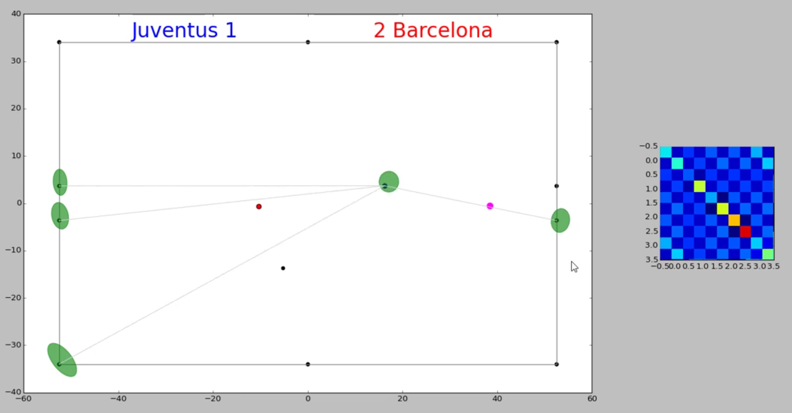
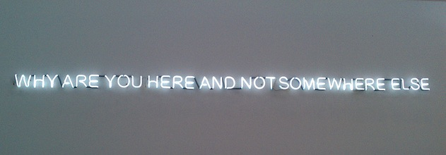

# A Non-Traditional MBA's Mid-point Look-back

_2015-09-21_

A little over a year ago, my wife Sarah, our little friend Antoni and I made a series of trips
from Singapore &ndash; where Sarah'd lived for 10 years and I'd 6, and where Antoni was born in February 2014 &ndash;
to our homes in Viet Nam, and ultimately to Chicago via a 27-hour set of flights
on which 6-month-old Antoni helpfully fixed fellow passengers' jet lags by simply not letting them sleep.

And, _boy_, where, and how has all that year gone? Before I felt like I was anywhere near ready,
[Chicago Booth](http://www.ChicagoBooth.edu) moved me to its 2nd-Year MBAs list,
with the school's huge academic buffet feast of brain-hurting classes starting again in juat 3 days.
On the family front, Sarah and I are expecting another baby boss within less than six months,
and hence picturing another tsunami of grueling hard work smashing at us.

So, in the one year now well past, besides acquiring Chicagoan/American tastes such as
sit-on-the-grass outdoor classical/jazz concerts, thousand-mile drives, and apartments that I'd think be enough
for 10 of us back in Singapore, what have I managed to get done? This blog gives you a year-in-the-life peep.

## **TL;DR**

- [**A dozen online courses**](#OnlineCourses) in Machine Learning, Artificial Intelligence, Robotics
and general Data Science and Computer Science

- Being [**_a rat in a sack of rice_**](#RatInSackOfRice) with Chicago Booth's flexible curriculum
    - A taste of [**Booth's awesome Entrepreneurship offerings**](#BoothEntrepreneurship)
    - [**Data-intensive classes**](#UChicagoDataIntensiveCourses) at Booth and the broader University of Chicago,
    a.k.a. the Quant Paradise
        - trying out a [**Kaggle.com data-mining competition**](#KaggleAXA)
    - [**Science / Tech courses**](#UChicagoScienceAndTechCourses) in UChicago
        - A [**RoboSoccer game**](#RoboSoccer), final project for **_Robotics & Artificial Intelligence_**
        - Thoughts on [**use of drones for visual inspection in hazardous environments**](#DroneVisualInspection),
        final project for **_Computer Vision_**
    - A course in [**Modern Analytic Strategy & Practice**](#AnalyticStrategyAndPractice)
        - Case study on [**McDonald's analytics** applied to everything
        from **distribution centers**, **burgers**, **nuggets**, to **_Despicable Me_ minions**](#McDonaldsAnalytics)
    - A highly practical [**App Development**](#BoothAppDev) course

- Meeting some [**world-beating Computer Scientists / Statisticians**](#MeetingFamousComputerScientistsAndStatisticians)
    - [**Geoff Hinton**](#GeoffHinton) of UToronto / Google
    - [**John Lafferty**](#JohnLafferty) of our own dear UChicago
    - [**Mike Jordan**](#MikeJordan) of UC Berkeley
    
- My work in [**all things Machine Learning**](#AllThingsMachineLearning)
    - [**Trial Machine Learning classes**](#TrialMachineLearningClasses) for fellow Booth MBAs
    - Launching of [**world's first formal Machine Learning class at a leading b-school**]()

## Being a diligent schoolboy again

A irrepressible yearning for going back to school was the reason
I left [CapitaMalls Asia](http://www.CapitaMallsAsia.com), a great employer who nurtured my early career
through a dozen fruitful roles in my 6 years with the company.
And once I found myself a schoolboy again, I tried to make the most of the chance.

### Online Courses

Before starting at Booth, I took a plethora of **online courses** on [Coursera.com](http://www.Coursera.com),
eventually completing a dozen of them. What excited me the most were Coursera's excellent offerings in
**Machine Learning**, **Artificial Intelligence**, **Robotics** and general
**Data Science** and **Computer Science**.

I'd already taught myself to code in 3-4 computer languages and built a solid foundation in Data Science 
through my last 3 years at CapitaMalls, during which I worked on building several Analytics systems to mine
the company's increasingly vast trove of Leasing, Marketing and Operations data.
But what Coursera did a tremendous job in was helping me gain a fully up-to-date picture of
where these exciting fields were heading in terms of really advanced technological applications.

_Machine Learning involves some hair-raising math:_

### Chicago Booth courses

At Booth, I found myself a fish in the water &ndash; or, as we say it in an equivalent Oriental metaphor,
_"a rat in a sack of rice"_ &ndash; with **the school's enormous and uber-flexible curriculum offerings**.
Not only there are uncountable exciting courses _(try counting the Finance classes, which Booth is famous for)_,
there is a _huge_ amount of freedom in crafting one's individualized learning path. By this mid-point in the program,
I've managed to complete 13 courses, 2/3 of my degree requirement, including the following highlights:

 

- _ENTREPRENEURSHIP @ BOOTH_: **_Entrepreneurial Selling_** by serial entrepreneur
    [Craig Wortmann](http://www.chicagobooth.edu/faculty/directory/w/Craig-Wortmann),
    **_Entrepreneurship through Acquisition_** by Private Equity/Search Funds veterans
    [Mark Agnew](http://www.chicagobooth.edu/faculty/directory/a/Mark-Agnew) and
    [Brian O'Connor](http://www.chicagobooth.edu/faculty/directory/o/Brian-O-Connor),
    and the ultimate showdown **_New Venture Challenge Lab_** led by renowned professors
    [Steve Kaplan](http://www.chicagobooth.edu/faculty/directory/k/Steven-Neil-Kaplan) and
    [Ellen Rudnick](http://www.chicagobooth.edu/faculty/directory/r/Ellen-A-Rudnick).
    All are part of Booth's world-beating, already-awesome-and-increasing-so Entrepreneurship curriculum
    championed by the [Polsky Center](http://research.chicagobooth.edu/Polsky), which also runs
    an impressive [Entrepreneurship Essentials](http://careeradvancement.uchicago.edu/entrepreneurship/essentials)
    workshop series.
    
    - In my upcoming 2nd year, I am back for more Entrep goodness in **_Building the New Venture_** by
    [Waverly Deutsch](http://www.chicagobooth.edu/faculty/directory/d/waverly-deutsch)
    
     
    
- _DATA-INTENSIVE COURSES_ &ndash;
oodles of them available, to my heart's delight &ndash; in what is the quantitative paradises
that are Booth and UChicago.
At Booth, I took **_Big Data_** by rising star
[Matt Taddy](http://www.chicagobooth.edu/faculty/directory/t/Matt-Taddy).
    - For the final project, I made a fairly creditable attempt at tackling this
    [very big and very wild driving telematics tracking data set on Kaggle.com](http://www.kaggle.com/c/axa-driver-telematics-analysis)
    hosted by insurance giant AXA. Below were plots showing individual drivers' highly characteristic
    accelerating and turning behaviors detected by my pattern-recognition algorithms:
    
    
    
     
    
    Another quant must-try was **_Machine Learning & Large-Scale Data Analysis_**
by UChicago's leading Machine Learning guru [John Lafferty](https://galton.uchicago.edu/~lafferty).
His course was a sweeping survey of head-cracking math and literally astronomical data sets
_(e.g. characteristic light curves from dozens of thousands of planets and stars)_.
More on Lafferty [below](#JohnLafferty).

    _Lafferty's homework featured undoubtedly astronomical data transmitted from the Kepler space telescope:_
    
    
    
    
 

- _SCIENCE / TECH COURSES_ in UChicago:
Booth's flexible curriculum enables me to try out great offerings elsewhere within the vast UChicago system. 
My hands-down favorite was **_Robotics & Artificial Intelligence_** by
[Matt Walter](http://ttic.uchicago.edu/~mwalter),
a UIUC- and MIT-trained roboticist and one of the builders of the MIT Self-Driving Car, which
finished in the top 5 in [DARPA's 2007 Urban Challenge](http://archive.darpa.mil/grandchallenge).

    - My final Robotics programming project, perfectly timed shortly before the European (Soccer) Cup final,
    was this [**RoboSoccer game**](http://www.Facebook.com/LuongTheVinh/videos/vb.36917371/10101310626436280/?type=2&theater),
    employing an algorithm called _"Extended Kalman Filter-based Simultaneous Localization and Mapping" (EKF SLAM)_.
    Here is my [**entire paper** on this game](RoboSoccer.pdf) for your reading pleasure.
    
        _My bots basically locate and orient themselves on the field by estimating their distances from various landmarks,
    e.g. goal posts and corner flags; they then try chase the pink ball and kick it towards the goal.
    [**CLICK**](http://www.Facebook.com/LuongTheVinh/videos/vb.36917371/10101310626436280/?type=2&theater)
    the below image to see a live match:_
    
        
    
     
    
    I also got a taste of **_Computer Vision_** by
[Sam Armato](http://radiology.uchicago.edu/directory/Samuel-Armato-III) and
[Maryellen Giger](http://radiology.uchicago.edu/directory/Maryellen-L-Giger),
seasoned scientists who have been spending many decades developing
automated visual analysis technologies for advanced medical equipment.
    
    - I presented a brief paper outlining my thoughts on
    how the same Computer Vision techniques may be used by drones to
    automate visual inspection of mechanical faults in highly hazardous environments,
    _e.g._ near oil or natural gas pipelines
    
     
    
    _Because both profs are medical doctors, they gave us this chest X-ray
    to play around with in mathematical / scientific ways, for 10 weeks...
    Why not a picture with real flesh for better motivating students?_
    
    

 

- _ANALYTIC STRATEGY & PRACTICE_:
I attended **_Modern Analytic Strategy and Practice_** by [Bob Grossman](http://rgrossman.com),
a UChicago professor, Data Analytics veteran, and inventor of several high-performance data technologies.
This course painted a sobering picture explaining why, and how, numerous Analytics executives, teams, projects,
M&As, and organizations fail &ndash; and pointed out highly practical remedies.
    
    - For the final project, my teammates and I took a look at
    analytics at McDonald's and its service providers, seeing how advanced number-crunching is done
    on vast &ndash; _really vast_ &ndash; amounts of data on anything countable,
    from distribution centers and transportation costs, to daily inventories of beef burgers, chicken nuggets
    and the uber-popular _Despicable Me_ minion toys...

   
  
- _APP DEVELOPMENT_: Thanks to massive amounts of hard work by my great pals over at
[Booth Hacks](http://www.chicagobooth.edu/programs/full-time/student-experience/beyond-classroom/groups/booth-hacks),
who trial-ran an 8-week proof-of-concept web development course in 2013-2014,
Booth now has a always-sold-out **_App Development_** course wonderfully taught by
[Raghu Betina](http://www.chicagobooth.edu/faculty/directory/b/Raghu-Betina),
a course that takes many initially feeble new coding hands and turns them into competent ones capable of
producing apps to track and analyze credit-card spends or to remind one to dry-clean one's clothes, _etc._
    
    - I successfully built 2 apps over the 2015 summer, dedicating them to my wife Sarah
    (basically using her free labor to beta-test them for me).

## Meeting world-beating Computer Scientists / Statisticians

Bumping into world-famous quant people at UChicago is as easy as seeing movie stars walking around in Hollywood.
I have so far met:

- <a name="GeoffHinton">[**Geoff Hinton**](http://en.wikipedia.org/wiki/Geoffrey_Hinton)</a>,
a towering Machine Learning / A.I. giant of our time and one of the fathers of
[Deep Learning](http://en.wikipedia.org/wiki/Deep_learning). I've met him not just once, but **thrice**,
at his distinguished guest lectures at [UChicago's Totoya Tech Institute](http://www.ttic.edu).
We two are actually fellow alumni of Cambridge University, U.K. _(yay!)_.
He shook my hand once &ndash; only after a considerable pause of hesitation &ndash;
and then told me that, as a business student looking to exploit his algorithms for monetary gains,
I should really pay to sit there. But I think he doesn't hate me, or care enough to do so.
    
    _Hinton the intellectual giant prefers to keep himself small,
    here delivering his lecture from the very corner of the room,
    avoiding the limelight:_
    
    

- <a name="JohnLafferty">[**John Lafferty**](http://en.wikipedia.org/wiki/John_D._Lafferty)</a>,
who founded the world's first Machine Learning department at Carnegie Mellon University,
and then joined UChicago &ndash; _with an O.K.-plus moving package, for sure_ &ndash; to make us great.
His signature course **_Machine Learning & Large-Scale Data Analysis_** attracted crazily-crowded,
rock-concert-like attendance, with students sitting elbow-to-elbow on chairs, more students sitting on the floor,
and yet more students peeping from outside the door, like so:

    _(photo courtesy of my senior Booth friend and fellow Data Science coder **Mo Bhasin**, class of 2014)_

- <a name="MikeJordan">[**Mike Jordan**](http://en.wikipedia.org/wiki/Michael_I._Jordan)</a>,
not of Chicago Bulls but rather of UC Berkeley. He came to give a guest lecture on some
highly performant algorithms to deal with really big data.
    
    _Apparently, to fully understand Jordan's math, one must sometimes trade off some valuable hair:_
    
    

## All things Machine Learning

During Booth's Orientation, when I told my dear classmates I was into **Machine Learning**, **A.I.** and **Robotics**,
a few pointed me to a wall at Harper Center, where there is a neon contemporary artwork saying (asking?)
in a kinda dark, haunting way:

When I came over to UChicago's Computer Science and Statistics departments to attend lectures and talks,
and told folks there I was from the b-school, I received identical reception &ndash;
_i.e._, "_Why (the hell) are you here?_".

Needless to say, my academic and professional paths during this past year have been anything but standard.
I missed out on a few staples of the MBA life, such as on-campus recruiting, and wandered further afield from
Booth's Harper Center to spend time at UChicago's various mathematical and technological institutions,
seeking exotic non-MBA classes.

But I have also ploughed much of my wayward learnings back to Booth,
trying to **make Machine Learning happen at Booth**, to bring its cutting-edge benefits
to the context of modern business operations and management.
And in doing so, I have received warm reception and encouragement from many classmates and faculty members
in Booth's open, curious and progressive academic environment.

### Trial Machine Learning classes for Booth MBA friends

In late November 2014, I reached out to invite some Booth friends to try out a 4-week Machine Learning crash course,
focusing on [**Predictive Analytics and Pattern Recognition using Neural Networks**](NeuralNetworksForPatternRecognition.pdf).
I got lots of help from my close pal **_Kathy Le_** and her husband **_Khoi Nguyen_** _(give 'em a shout!)_
to organize 3-hour Saturday-afternoon classes at Park Millennium's business center. They even volunteered their TV
for me to present my materials, as Park Mill's TV was very broken.

About 8 joined at the beginning, and 5 went all the way to finish this experimental course.
We used a Matlab programming package I'd been coding up for 8 months to run demos on classic
Machine Learning / Neural Networks use cases in **optical character recognition** (**OCR**).
My friends brought home real, serious homework with **multiple-choice questions**, **write-up questions**,
a case study on **Google's self-driving cars**, and **Matlab programming assignments**.
The course culminated in a \*\*\***high-adrenalin live final competition**\*\*\* in which
everyone was given 1.5 hours to build a Neural Network to rate the quality of bicep curls
_(with data collected from fitness tracking devices)_.

_Machine Learning class finalists: **Khoi Nguyen**, **Kathy Le**, **Keith Wagner**, **Eric Cheng**,
me (= warden / referee), **Juan Yrigoyen**. Everyone owes a beer to Eric (Booth Hacks co-chair, Google intern),
who tops the final with a stunning 99.2% accurate bicep curl quality classification model:_
    

### REAL, for-credit Machine Learning course for Booth MBAs &ndash; _WORLD's FIRST of Its Kind!_

[to be continued...]

 
## Launched this personal website

[to be continued...]
